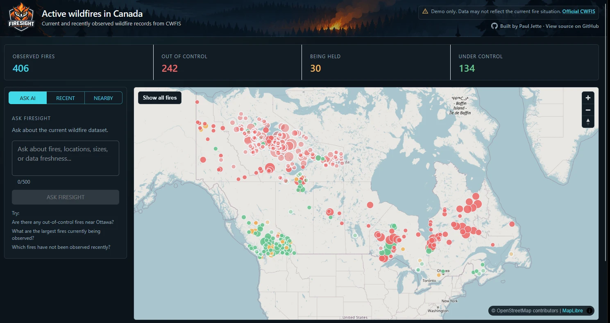

# Firesight

[](https://github.com/pauljettedev/Firesight/actions/workflows/ci.yml)

A live map of Canadian wildfires, built as a portfolio project. It syncs data from the
Canadian Wildland Fire Information System (CWFIS) every hour, stores it in PostgreSQL/PostGIS,
and serves it through a React map, a REST API, MCP tools for AI assistants, and a
plain-English question box answered by Claude.

**Live:** https://firesight.codewheel.ca · a demo, not an official wildfire service
([disclaimer](#disclaimer))



## Features

- Map of current wildfires with status, size, and how recently each fire was reported
- Find fires within a distance of a town or city
- **Ask Firesight:** ask questions in plain English ("any fires near Kamloops?")
- MCP tools, so AI assistants can query the same data

## Try it with an AI assistant

Firesight's MCP server is public. To connect Claude Code to it:

```bash
claude mcp add --transport http firesight https://firesight.codewheel.ca/mcp
```

Then ask Claude something like "what are the largest wildfires in BC right now?". It looks the
answer up in Firesight's live data. More detail: [MCP](docs/mcp.md).

## Under the hood

**AI answers checked against real data.** Ask Firesight gives Claude tools that call
Firesight's own services. Claude decides what to look up, but for "how many", "are there
any", and "what's the status of" questions, the code works out the answer from the actual
results instead of trusting the model to count. The fires Claude links to an answer are
checked against the fires its tools really returned, and any it made up are dropped.
Requests are rate limited and length capped to keep cost bounded.

**One set of business logic, three front doors.** The REST API, the MCP tools, and Ask
Firesight all call the same application services, so spatial queries and rules are written
once. Business rules live in the domain layer as expressions that EF Core turns into SQL, so
they're unit tested without a database but still run as `WHERE` clauses in PostGIS.

**Careful data sync.** CWFIS publishes a time-versioned feed. Each sync reads every page at
the same snapshot instant, with a fixed sort order, so a record can't be skipped or counted
twice. The sync is all-or-nothing: if any page fails, nothing is applied. Records without an
ID are rejected and counted rather than guessed at.

**Honest about freshness.** Firesight tracks when the feed was last fetched separately from
when each fire was last seen in it. A fire missing from recent syncs is flagged as stale,
but its official status is never changed. Firesight only reports what CWFIS said.

**Spatial search in the database.** "Fires within 200 km of Ottawa" is a PostGIS geography
query (`ST_DWithin`), measured in real distances on the globe and sorted by distance.

**Tested against the real thing.** Integration tests start a disposable PostGIS container,
apply the real migrations, and run the actual spatial queries, not an in-memory fake. The MCP
tools are tested through a real MCP client connection. The UI has its own component tests.

**Shipped, not just built.** Every push to `main` runs the tests, then deploys to a
DigitalOcean droplet over SSH. The deploy action is pinned to a commit and the server's
identity is checked before connecting.

Why each of these was built this way is written up in the
[decision records](docs/decisions/README.md).

## Stack

React, TypeScript, MUI, MapLibre · ASP.NET Core (.NET 10), EF Core · PostgreSQL/PostGIS ·
Claude API, MCP · Docker, GitHub Actions, Caddy

## Run locally

Needs the .NET 10 SDK, Node.js LTS, and Docker.

```powershell
docker compose up -d                                   # database
dotnet run --project src/Firesight.Api                 # API on :5213
cd src/Firesight.Web; npm install; npm run dev         # web app on :5173
```

Full steps, including the Claude API key for Ask Firesight: [Setup](docs/setup.md).

## Tests

```powershell
dotnet test                                    # backend (needs Docker running)
cd src/Firesight.Web; npm test; npm run lint   # frontend
```

## Documentation

- [Setup](docs/setup.md): run and test locally
- [Architecture](docs/architecture.md): how the projects fit together
- [API](docs/api.md): REST endpoints
- [MCP](docs/mcp.md): MCP tools
- [Data sources](docs/data-sources.md): how CWFIS data is loaded and stored
- [Decisions](docs/decisions/README.md): why things are built the way they are
- [Deployment](docs/deployment.md) and [server setup walkthrough](docs/server-setup-walkthrough.md)
- [CWFIS historical data](docs/cwfis-historical-reference.md): research notes for a future feature
- [References](docs/references.md): official docs for the tools used

## Disclaimer

Firesight is a demo. Do not use it for emergency, evacuation, or safety decisions. For
official wildfire information, use [CWFIS](https://cwfis.cfs.nrcan.gc.ca/) and your provincial
or territorial wildfire agency.

## License

[MIT](LICENSE)
