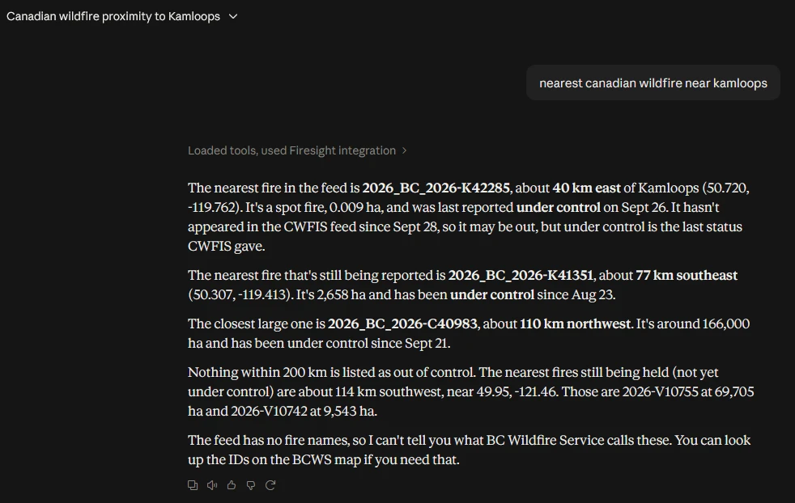

# Firesight

[](https://github.com/pauljettedev/Firesight/actions/workflows/ci.yml)

A live map of Canadian wildfires, built as a portfolio project. It syncs data from the
Canadian Wildland Fire Information System (CWFIS) every hour, stores it in PostgreSQL/PostGIS,
and serves it through a React map, a REST API, MCP tools for AI assistants, and a
plain-English question box answered by Claude.

**Live:** https://firesight.codewheel.ca · a demo, not an official wildfire service
([disclaimer](#disclaimer))


## Features

- Map of current wildfires with status, size, and how recently each fire was reported
- Find fires within a distance of a town or city
- **Ask Firesight:** ask questions in plain English ("any fires near Kamloops?")
- MCP tools, so AI assistants can query the same data

## Try it with an AI assistant

Firesight's MCP server is public, with no login, so you can connect Claude to it in a minute:

1. In [Claude](https://claude.ai), open **Settings → Connectors** and choose **Add custom connector**.
2. Name it `Firesight` and enter `https://firesight.codewheel.ca/mcp`.
3. In a new chat, ask something like "what's the nearest wildfire to Kamloops?"

Claude calls Firesight's tools and answers from its live data. To use it from Claude Code
instead, see [MCP](docs/mcp.md).



## Under the hood

**AI answers checked in code.** Claude chooses what to look up, but counts and statuses come
from the real data, not the model. Fire IDs Claude can't back up are dropped.

**Business logic written once.** The REST API, the MCP tools and Ask Firesight share the same
application services. Spatial queries and domain rules run as SQL in PostGIS, and the rules
are unit tested without a database.

**Reliable sync.** Each CWFIS sync is all-or-nothing, so the map never shows a half-updated
feed.

**Honest about freshness.** Fires missing from the feed are marked stale, then hidden after
5 days. Firesight never changes the status CWFIS reported.

**Tested against the real database.** Integration tests run against PostGIS in Docker, not an
in-memory fake.

**Deployed automatically.** Every push to `main` is tested and deployed.

The reasons behind these choices are in the [decision records](docs/decisions/README.md).

## Stack

React, TypeScript, MUI, MapLibre · ASP.NET Core (.NET 10), EF Core · PostgreSQL/PostGIS ·
Claude API, MCP · Docker, GitHub Actions, Caddy

## Run locally

Needs the .NET 10 SDK, Node.js LTS, and Docker.

```powershell
docker compose up -d                                   # database
dotnet run --project src/Firesight.Api                 # API on :5213
cd src/Firesight.Web; npm install; npm run dev         # web app on :5173
```

Full steps, including the Claude API key for Ask Firesight: [Setup](docs/setup.md).

## Tests

```powershell
dotnet test                                    # backend (needs Docker running)
cd src/Firesight.Web; npm test; npm run lint   # frontend
```

## Documentation

- [Setup](docs/setup.md): run and test locally
- [Architecture](docs/architecture.md): how the projects fit together
- [API](docs/api.md): REST endpoints
- [MCP](docs/mcp.md): MCP tools
- [Data sources](docs/data-sources.md): how CWFIS data is loaded and stored
- [Decisions](docs/decisions/README.md): why things are built the way they are
- [Deployment](docs/deployment.md) and [server setup walkthrough](docs/server-setup-walkthrough.md)
- [CWFIS historical data](docs/cwfis-historical-reference.md): research notes for a future feature
- [References](docs/references.md): official docs for the tools used

## Disclaimer

Firesight is a demo. Do not use it for emergency, evacuation, or safety decisions. For
official wildfire information, use [CWFIS](https://cwfis.cfs.nrcan.gc.ca/) and your provincial
or territorial wildfire agency.

## License

[MIT](LICENSE)
